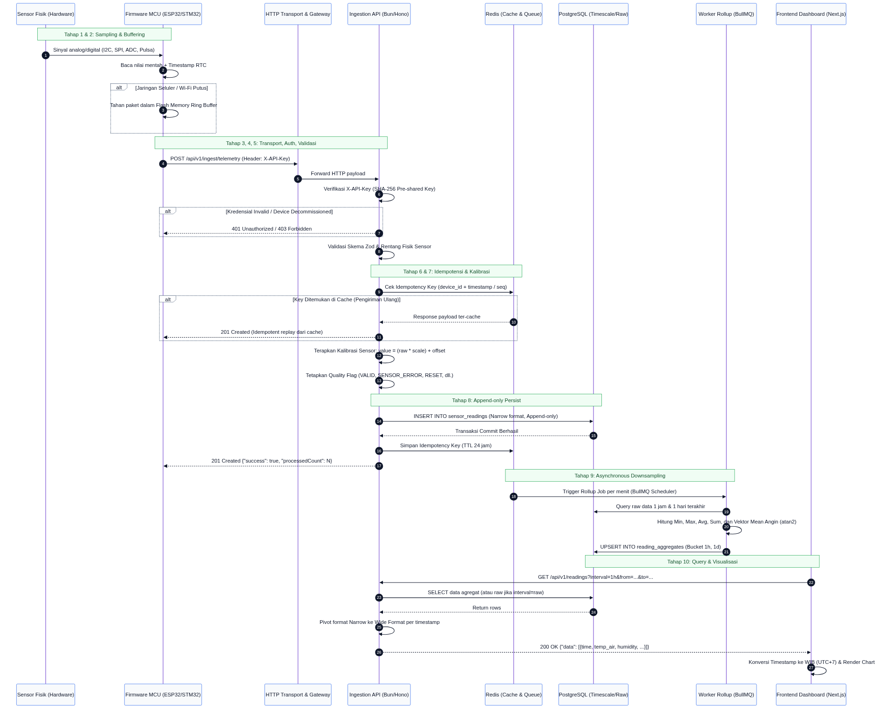

# Arsitektur Alur Data Telemetri (Data Flow Architecture)

Dokumen ini menjelaskan alur data end-to-end dari stasiun cuaca IoT (sensor fisik) hingga data tersimpan dan divisualisasikan pada dashboard frontend, mencakup arsitektur pipeline, mekanisme keandalan, dan penanganan skenario kegagalan (failure modes).

---

## 1. Diagram Alur Data (Sequence Diagram)

  

---

## 2. Penjelasan 10 Tahapan Alur Data

Pipeline pemrosesan data dirancang dalam 10 tahapan modular untuk memastikan integritas, keandalan, dan performa tinggi:

### Tahap 1: Sensor Fisik (Transduksi & Pembacaan Hardware)

Sensor cuaca membaca parameter lingkungan secara periodik:

- **Suhu & Kelembaban (misal SHT31/DHT22)**: Komunikasi digital melalui bus I2C.
- **Tekanan Udara (misal BMP280/BME280)**: Komunikasi I2C/SPI.
- **Anemometer (Kecepatan Angin)**: Menghasilkan tegangan analog linier (0-5V atau 4-20mA) yang dibaca oleh ADC.
- **Wind Vane (Arah Angin)**: Resistor divider potensiometer yang menghasilkan sudut 0 hingga 360 derajat.
- **Tipping Bucket Rain Gauge**: Sakelar reed switch mekanis yang menghasilkan interupsi pulsa counter saat wadah penampung air berayun (1 tip = 0.2 mm air).
- **Solar Radiation**: Sensor fotodioda yang membaca densitas daya radiasi matahari dalam W/m2.

### Tahap 2: Firmware Device (Sampling, RTC, dan Buffering)

Mikrokontroler stasiun cuaca (misal ESP32 atau STM32) menjalankan siklus sampling:

- Nilai sensor dibaca setiap interval tertentu (misal tiap 10 detik atau 1 menit).
- Real-Time Clock (RTC) onboard memberikan timestamp waktu lokal perangkat (`device_time`).
- Jika jaringan modem GSM/4G atau LoRa terputus, firmware secara otomatis menyimpan pembacaan ke dalam ring buffer Flash/SPIFFS internal (kapasitas buffer hingga 72 jam data) untuk mencegah kehilangan data selama periode offline.

### Tahap 3: Transport Layer (HTTP / TLS)

Saat koneksi internet tersedia, stasiun cuaca mengirim data ke server gateway backend:

- Menggunakan protokol HTTP POST dengan payload JSON terkompresi.
- Mendukung dua endpoint transport:
  - `/api/v1/ingest/telemetry`: Untuk pengiriman realtime reguler (1 paket per siklus).
  - `/api/v1/ingest/telemetry/batch`: Untuk pengiriman sekaligus paket-paket yang tertahan di memory buffer selama stasiun offline (maksimal 500 item per request batch).

### Tahap 4: Autentikasi Device

Sebelum payload diproses, server memeriksa hak akses perangkat:

- Device wajib mengirim header `X-API-Key`.
- Server mencocokkan hash SHA-256 dari key terhadap secret yang tersimpan di database menggunakan komparasi _constant-time_ untuk mencegah serangan _timing attack_.
- Memeriksa status operasional perangkat: jika status adalah `decommissioned`, server mengembalikan status `403 Forbidden`. Jika device ID tidak ditemukan, server mengembalikan status `404 Not Found`.

### Tahap 5: Validasi Payload (Schema & Range Check)

Payload divalidasi secara ketat menggunakan schema engine (Zod):

- Memeriksa kelengkapan field wajib: `device_id`, `ts` (Unix epoch), dan array `readings`.
- Memeriksa batas rentang valid tipe sensor: jika nilai berada di luar batas fisik yang wajar (contoh: kelembaban udara bernilai 150%), data tidak dibuang mentah-mentah, melainkan dilanjutkan ke tahap berikutnya dengan penandaan status.
- Memeriksa clock drift: jika timestamp berada lebih dari 5 menit di masa depan dibanding waktu server, data diberi penanda khusus.

### Tahap 6: Normalisasi & Deduplikasi Idempoten

Mencegah duplikasi data akibat jaringan yang tidak stabil (retry saat ACK timeout):

- Server menyusun idempotency key unik: `idempotency:ingest:<device_id>:<timestamp>:<hash>`.
- Server memeriksa kunci di Redis:
  - Jika kunci sudah ada, server mengembalikan respon 201 yang sama dari cache tanpa melakukan insert ulang ke database.
  - Jika kunci baru, pemrosesan dilanjutkan.
- Di lapisan basis data, tabel `sensor_readings` dilindungi oleh komposit unique constraint `(device_id, sensor_id, time)`.

### Tahap 7: Enrichment (Kalibrasi & Quality Flags)

Sebelum disimpan, nilai mentah (`raw_value`) diproses menjadi nilai terkalibrasi (`value`):

- Server mengambil parameter kalibrasi aktif untuk sensor terkait (`scale` dan `offset`):
  $$
  \text{value} = (\text{raw\_value} \times \text{scale}) + \text{offset}
  $$
- Nilai mentah asli tetap dipertahankan pada kolom `raw_value` untuk kebutuhan audit rekonstruksi.
- Penetapan `quality_flag`:
  - `VALID`: Nilai normal memenuhi rentang validasi.
  - `OUT_OF_RANGE`: Nilai di luar batas rentang fisik sensor (misal kelembaban 150%).
  - `SENSOR_ERROR`: Sensor mengirim kode kerusakan hardware (misal -999 atau NaN).
  - `RAIN_RESET`: Terdeteksi reboot counter curah hujan (penurunan nilai counter).
  - `FUTURE_TIMESTAMP`: Timestamp perangkat terpaut maju > 5 menit dari waktu server.

### Tahap 8: Penyimpanan Raw Reading (Append-Only)

Data yang telah divalidasi dan diperkaya disimpan ke PostgreSQL:

- Model penyimpanan bersifat **strictly append-only** ke tabel `sensor_readings`.
- Disimpan dalam format **Narrow/Long** (satu baris per metrik sensor) untuk fleksibilitas tipe sensor.
- Operasi multi-baris dieksekusi dalam satu transaksi atomik (`BEGIN ... COMMIT`) atau multi-row insert untuk efisiensi I/O disk dan Write-Ahead Logging (WAL).

### Tahap 9: Agregasi Asinkron Latar Belakang (BullMQ Rollup Worker)

Untuk mencegah query grafik frontend membebani tabel raw yang berisi ratusan juta baris:

- Background worker BullMQ dijalankan secara terpisah dari web server.
- Setiap menit, worker membaca baris baru dan melakukan agregasi downsampling ke interval 1 jam (`1h`) dan 1 hari (`1d`).
- Metrik yang dihitung: `min_value`, `max_value`, `avg_value`, `sum_value`, dan `reading_count`.
- **Rata-rata Arah Angin**: Menggunakan dekomposisi vektor trigonometri $\text{atan2}(\sum \sin \theta, \sum \cos \theta)$ untuk menghindari kesalahan rata-rata sudut circular.
- Hasil disimpan ke tabel `reading_aggregates` dengan mekanisme `ON CONFLICT DO UPDATE` (upsert).

### Tahap 10: API Query & Visualisasi Frontend

Penyajian data kepada pengguna di antarmuka Next.js:

- Frontend memanggil `GET /api/v1/readings` dengan filter rentang tanggal dan interval downsampling yang sesuai (24 jam = raw/1m, 7 hari = 1h, 30 hari = 1d).
- API secara otomatis mem-pivot data Narrow dari basis data menjadi format Wide per titik waktu (`timestamp`) agar siap dikonsumsi langsung oleh komponen Recharts.
- Konversi timezone terpusat dari UTC database ke Waktu Indonesia Barat (WIB / UTC+7).
- Frontend menampilkan state: loading indicator, empty state, dan alert status offline bila stasiun tidak mengirim data lebih dari 15 menit.

---

## 3. Analisis 6 Masalah Kritis Arsitektur Alur Data (Bagian D)

### D.1 Mekanisme Idempotensi

_Masalah_: Stasiun cuaca di lapangan sering mengalami koneksi lemah di mana paket HTTP POST berhasil diterima server, tetapi perangkat tidak sempat menerima respon HTTP 201 ACK karena timeout jaringan. Akibatnya, firmware melakukan transmisi ulang paket yang sama.

_Solusi Konkret_:

1. **Cache Dedup Window (Redis)**: Server menghitung hash dari `(device_id, timestamp, readings_payload)`. Sebelum query DB, server mengecek Redis via `GET idempotency:<hash>`. Jika ditemukan, server langsung membalas 201 dengan payload respon tersimpan. Kunci ini disimpan dengan masa retensi (TTL) selama 24 jam.
2. **Database Unique Constraint**: Pada tabel `sensor_readings`, dibuat constraint unik `UNIQUE (device_id, sensor_id, time)`. Jika terjadi _race condition_ di mana dua request bersamaan lolos dari Redis, database menolak baris duplikat melalui penanganan `ON CONFLICT DO NOTHING`.

### D.2 Data Terlambat & Tidak Berurutan (Late / Out-of-Order Data)

_Masalah_: Stasiun cuaca offline selama 3 jam di lokasi blank spot seluler, kemudian kembali online dan mengirim 180 record sekaligus secara batch. Agregat jam untuk 3 jam sebelumnya telah selesai dihitung oleh worker.

_Solusi Konkret_:

1. **Batch Ingestion**: Endpoint `/api/v1/ingest/telemetry/batch` menerima hingga 500 paket dalam satu transaksi tanpa menolak record masa lampau.
2. **Re-aggregation Trigger**: Setiap kali data historis (timestamp > 1 jam lalu) berhasil masuk, server mendaftarkan job rollup perbaikan ke queue BullMQ untuk bucket jam yang bersangkutan. Worker akan menghitung ulang agregat bucket tersebut, memastikan laporan agregat tetap akurat tanpa memerlukan intervensi manual.

### D.3 Manajemen Backpressure (Lonjakan Trafik Simultan)

_Masalah_: Puluhan stasiun cuaca mengirim data secara serentak pada detik ke-00 tiap menit, berpotensi membebani thread pool basis data.

_Solusi Konkret_:

1. **Connection Pooling**: PostgreSQL diakses melalui pool koneksi terkelola dengan batas maksimum koneksi aktif agar tidak terjadi _resource exhaustion_.
2. **Bulk Multi-Row Insert**: API tidak melakukan query `INSERT` satu per satu. Untuk 1 paket berisi 7 sensor, data digabungkan ke dalam 1 statement SQL multi-baris (`INSERT INTO sensor_readings VALUES (...), (...), (...)`).
3. **Queue Decoupling**: Jika beban ingestion melebihi kapasitas throughput I/O basis data, endpoint HTTP dapat memindahkan payload mentah langsung ke antrean Redis Stream/BullMQ dan membalas `202 Accepted` dalam hitungan milidetik, sementara worker pool di belakang memproses batch insert secara bertahap.

### D.4 Perbedaan Waktu & Penanganan Clock Drift

_Masalah_: Jam internal mikrokontroler (RTC) perangkat cuaca dapat mengalami pergeseran waktu (clock drift) akibat suhu ekstrem atau baterai RTC CMOS yang melemah.

_Solusi Konkret_:

1. **Pemisahan Kolom Waktu**:
   - `time` (`device_time`): Waktu pembacaan fisik sensor dari RTC perangkat. Kolom ini menjadi **kunci utama time-series** karena mewakili kondisi cuaca aktual saat fenomena terjadi.
   - `server_time`: Waktu saat server HTTP menerima paket (selalu sinkron dengan NTP server).
2. **Aturan Validasi Clock Drift**:
   - Jika `device_time` tertinggal dibanding server (data masa lampau): Diterima sebagai data buffer offline normal.
   - Jika `device_time` mendahului `server_time` hingga 5 menit: Diterima normal (toleransi latensi jaringan wajar).
   - Jika `device_time` mendahului `server_time` lebih dari 5 menit: Payload tetap disimpan agar tidak hilang, namun diberi penanda `quality_flag = 'future_timestamp'` sehingga dapat difilter pada visualisasi publik.

### D.5 Standarisasi dan Konversi Timezone

_Masalah_: Ketidakcocokan timezone antara stasiun lapangan, basis data, dan antarmuka monitoring pengguna.

_Solusi Konkret_:

1. **Penyimpanan Terpusat**: Semua tanggal dan waktu di basis data disimpan murni dalam format **UTC** menggunakan tipe data `TIMESTAMPTZ` (ISO-8601).
2. **Konversi di Lapisan Presentasi**: Stasiun cuaca di Indonesia umumnya beroperasi pada WIB (UTC+7), WITA (UTC+8), atau WIT (UTC+9). Konversi waktu dilakukan secara eksplisit pada frontend Next.js menggunakan library tanggal terpusat (`date-fns` / `Intl.DateTimeFormat`) dengan target zona `Asia/Jakarta` (WIB).

### D.6 Mode Kegagalan saat Database Down

_Masalah_: Server basis data PostgreSQL mengalami crash, maintenance, atau _connection timeout_ saat stasiun cuaca mengirim data.

_Solusi Konkret_:

1. **Proteksi Integritas Data**: API mendeteksi kegagalan koneksi DB dan mengembalikan respon HTTP `503 Service Unavailable` disertai header `Retry-After: 60`.
2. **Firmware Local Buffer**: Sesuai desain edge architecture, firmware stasiun cuaca **tidak menghapus data** dari ring buffer memori Flash lokal jika respon HTTP yang diterima bukan status sukses `2xx`. Stasiun akan mencoba mengirim ulang (_exponential backoff_) setelah jaringan atau server pulih, sehingga tidak ada data telemetri yang hilang.

---

## 4. Matriks Analisis Kegagalan (Failure Modes and Mitigation Matrix)

Tabel berikut merangkum potensi titik kegagalan pada setiap komponen arsitektur serta strategi mitigasi otomatisnya:

| Lapisan Sistem          | Titik Kegagalan                  | Dampak                           | Mekanisme Deteksi                        | Tindakan Mitigasi Otomatis                                                                       |
| ----------------------- | -------------------------------- | -------------------------------- | ---------------------------------------- | ------------------------------------------------------------------------------------------------ |
| **Sensor Fisik**        | Kabel putus / Pin I2C short      | Nilai pembacaan -999 atau NaN    | Range validator API                      | Menandai baris dengan flag`SENSOR_ERROR`, metrik sensor lain dalam stasiun tetap disimpan.       |
| **Sensor Fisik**        | Wadah tipping bucket tertahan    | Rain counter tidak bertambah     | Audit drift sensor                       | Deteksi status flatline (nilai identik > 6 jam) pada background analyzer.                        |
| **Firmware MCU**        | Daya padam / Stasiun reboot      | Rain counter reset ke 0          | Evaluasi delta counter                   | Mengabaikan penurunan, menghitung curah hujan dari nilai counter baru, memberi flag`RAIN_RESET`. |
| **Firmware MCU**        | Baterai RTC habis / Clock drift  | Timestamp melonjak ke masa depan | Perbandingan terhadap NTP server time    | Menandai baris dengan flag`FUTURE_TIMESTAMP` jika selisih > 5 menit.                             |
| **Jaringan Transport**  | Sinyal BTS GSM terputus          | Stasiun tidak bisa mengirim data | Healthcheck query > 15 menit             | Firmware menahan data di Flash buffer lokal; Dashboard menampilkan badge stasiun`Offline`.       |
| **Transport / Gateway** | Request retry akibat ACK timeout | Potensi data duplikat            | Cek hash di Redis & Unique DB constraint | Mengembalikan respon 201 dari cache tanpa insert duplikat (`ON CONFLICT DO NOTHING`).            |
| **Ingestion API**       | Lonjakan koneksi simultan        | Beban CPU & I/O spike            | Rate limiter Redis token bucket          | Rate limiting per device (60 req/min), multi-row batch insert, connection pool queue.            |
| **Basis Data**          | PostgreSQL downtime / failover   | API tidak dapat menulis data     | Catch error pool database                | API membalas`503 Service Unavailable`, stasiun cuaca mempertahankan buffer lokal untuk retry.    |
| **Rollup Worker**       | BullMQ worker crash              | Agregat 1 jam tertunda           | BullMQ job lock timeout                  | Job dikembalikan ke queue untuk diproses ulang oleh worker instance lain saat recovery.          |
| **Frontend Web**        | Kegagalan fetch API              | Tampilan rusak / layar putih     | Error boundary & state handling          | Komponen menampilkan`ErrorState` ramah pengguna disertai tombol `Coba Lagi`.                     |
